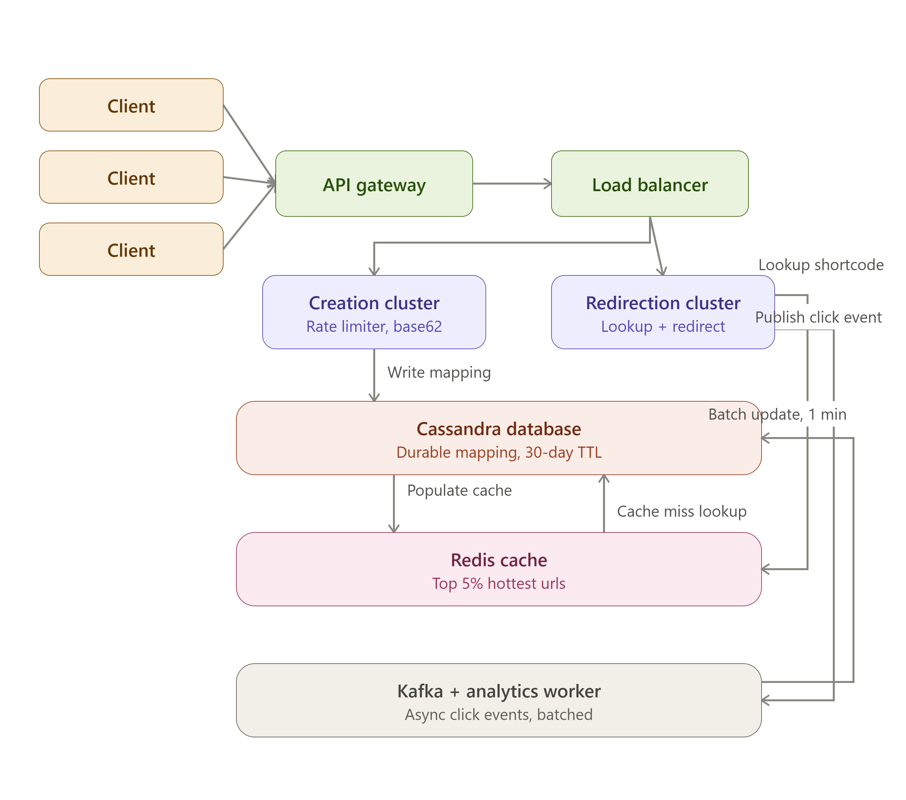

# URL shortener — system design

## 1. Problem

Take a long URL and generate a short, unique one that redirects visitors to the original destination. This is the same core problem behind services like Bitly and TinyURL.

## 2. Requirements

**Functional**
- Turn a long URL into a short one
- Redirect visitors from the short URL to the original
- Persist the mapping durably
- Expire links automatically after a set TTL
- Track per-link click analytics

**Non-functional**
- Support millions of URLs and heavy concurrent redirect traffic
- Sub-100ms redirect latency so clicks feel instant
- High availability, since every shortened link depends on the service being up
- Abuse prevention through rate limiting
- No data loss — durability is non-negotiable
- Resilience to individual component failures

## 3. Core idea

Underneath everything, this is just a key-value lookup:

```
short_code → long_url
```

The rest of the architecture exists purely to make that lookup fast, reliable, and resistant to abuse at scale. The design is split into two independent flows — **writes** (creating a short link) and **reads** (redirecting a click) — because in practice, far more people click links than create them, so the two flows need to scale very differently.

## 4. Components

**Client** — the browser or app initiating either a "shorten this" request or a click on an existing short link.

**API gateway** — the single front door for every request; handles auth and routes traffic internally so clients never need to know the backend topology.

**Load balancer** — spreads incoming traffic across many servers so no single machine becomes a bottleneck or a single point of failure.

**Creation cluster (write path)** — servers dedicated solely to shortening requests, isolated from redirect traffic so a spike in one doesn't degrade the other. Each cluster scales independently.

**Rate limiter (Redis, token bucket)** — blocks abusive traffic (e.g., scripted mass link creation). Each client — identified by IP plus device ID rather than IP alone, so people on shared networks aren't penalized together — gets a bucket of tokens that refill over time; every request spends one token, and the bucket running dry means the request is rejected.

**ID generator (Base62)** — a single, ever-increasing global counter assigns each new URL the next number, which is then encoded in Base62 (a–z, A–Z, 0–9). This keeps codes short and guarantees uniqueness by construction, sidestepping the collision handling that hashing the URL would require.

**Cassandra (write store)** — durably stores the short_code → long_url mapping along with a TTL (e.g., 30 days) so stale links get cleaned up on their own. Cassandra's horizontal scalability and high write throughput suit this simple key-value pattern better than a relational database would.

**Redirection cluster (read path)** — a separate fleet dedicated to the highest-volume traffic in the system: redirects.

**Redis cache** — holds only the hottest ~5% of URLs in memory, rather than caching everything, since most links see little traffic and caching them all would waste memory for no gain. A cache hit means a near-instant redirect; a miss falls through to the database.

**Cassandra (read replica)** — queried only on a cache miss. Once fetched, the result is written back into Redis so subsequent clicks on that link hit the cache.

**HTTP 302 redirect** — the server intentionally responds with a 302 (temporary) rather than a 301 (permanent) redirect. Browsers cache 301s and stop hitting the server on future clicks, which would corrupt analytics. A 302 guarantees the server sees every click.

**Kafka (async click events)** — instead of writing a click count to the database on every single redirect — which would slow down the user-facing response — the server just emits a lightweight "clicked" event to Kafka and returns immediately, decoupling the fast redirect from slower bookkeeping.

**Analytics worker** — a background consumer that reads click events off Kafka and batches updates into Cassandra (e.g., once a minute) instead of writing on every click, which is far more efficient at scale.

## 5. Why reads and writes are split

This is the single most consequential decision in the design. Redirects vastly outnumber link creations in any real deployment. By giving each flow its own cluster, caching strategy, and scaling policy, a traffic spike on one side never bleeds into the other.

## 6. Trade-offs

| Decision | Alternative | Why this choice wins |
|---|---|---|
| Counter + Base62 IDs | Hash the URL (e.g., MD5) and truncate | Sidesteps hash collisions and the retry logic they'd require |
| Cassandra (NoSQL) | Relational DB (Postgres/MySQL) | Scales horizontally far better for high-volume key-value access |
| Cache only the hottest 5% | Cache everything | Most links are barely clicked — full caching wastes memory |
| Kafka + async analytics | Update click counts synchronously | Keeps redirect latency low; users aren't blocked on bookkeeping |
| HTTP 302 | HTTP 301 | 302 isn't cached by the browser, so every click stays measurable |
| Separate write/read clusters | One shared cluster | Wildly different traffic volumes need independent scaling |