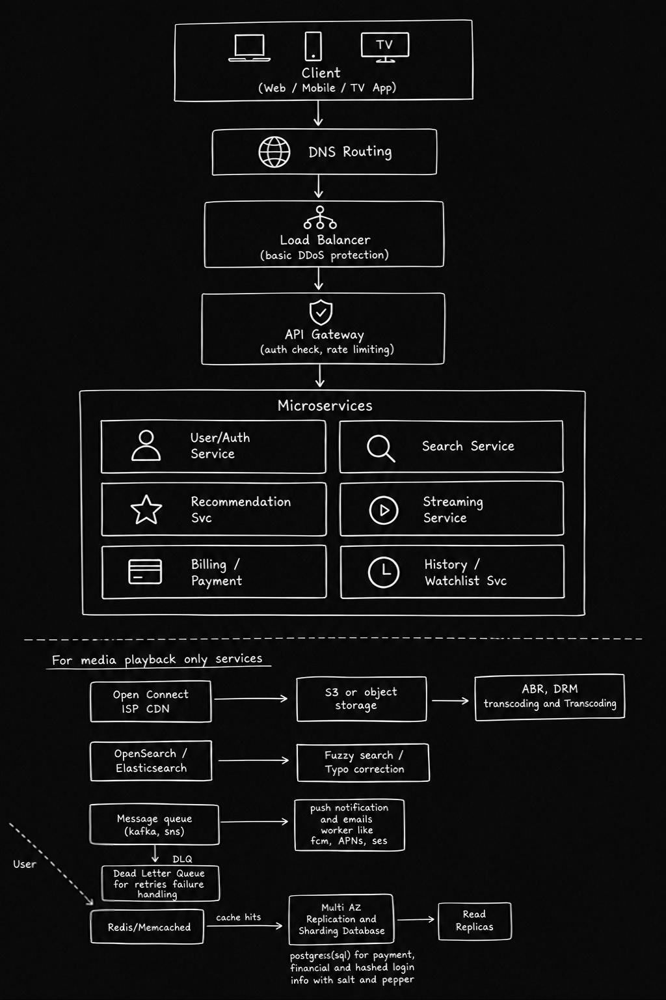

# Experiment 2 — System Design of Netflix

**Name:** Ishaan Sharma  
**UID:** 25BCS80006  
**Subject:** System Design  

---

## 1. Objective

To design a scalable and reliable video streaming platform similar to Netflix, covering the functional and non-functional requirements, capacity estimation, API design, high-level system architecture, and database design.

---

## 2. Functional Requirements

| # | Feature |
|---|---------|
| 1 | User registration / login |
| 2 | Multiple profiles per account |
| 3 | Browse and stream videos |
| 4 | Play / pause / seek / resume |
| 5 | Adaptive bitrate streaming based on network speed |
| 6 | Resume from last watched position |
| 7 | Watch history tracking |
| 8 | Add to "Watchlist" |
| 9 | Search for movies/shows |
| 10 | Subscription plans & billing |

---

## 3. Non-Functional Requirements

| Requirement | Target |
|-------------|--------|
| **Availability** | 99.9% uptime |
| **Scalability** | Should support growth to millions of users |
| **Latency** | API responses within 300–500 ms |
| **Video Start Time** | Under 3 seconds |
| **Fault Tolerance** | System should not have a single point of failure |
| **Consistency** | Watch history/billing should not be lost |
| **Security** | Encrypted data, authenticated access |

---

## 4. Capacity Estimation

### 4.1 User Base Assumptions

| Metric | Value |
|--------|-------|
| Total registered users | 50 M |
| Daily Active Users (DAU) | 15 M |
| Peak concurrent viewers (~20% of DAU) | 3 M |
| Average watch session | 1 hour |

*Note: A smaller regional platform is assumed here instead of a global-scale player, to keep the numbers realistic for a learning exercise.*

### 4.2 API Request Load

- Assume each active user makes **~6 API calls/minute** (browsing, search, history updates, etc.)
- Peak load: `3M × 6 / 60 ≈ 300K requests/sec`
- Adding a **1.5× safety buffer** → design target ≈ **450K RPS**

### 4.3 Streaming Bandwidth

| Metric | Value |
|--------|-------|
| Average bitrate per stream | 3 Mbps (mostly HD, not 4K-heavy) |
| Peak concurrent streams | 3 M |
| Total bandwidth | 3M × 3 Mbps = **9 Tbps** |
| With headroom (1.5×) | **≈ 13–14 Tbps** |

> Since video traffic dominates over API traffic, a **CDN with edge caching** is essential to avoid overloading origin servers.

### 4.4 Storage for Video Content

| Metric | Value |
|--------|-------|
| Total titles in catalog | ~20K |
| Average size per title (single resolution) | 4 GB |
| Base storage | 20K × 4 GB = **80 TB** |
| Multiple resolutions + audio tracks + subtitles (~6×) | **≈ 480 TB** |
| Rounded, with backups/replication | **~500 TB – 1 PB** |

### 4.5 User & Metadata Storage

| Metric | Value |
|--------|-------|
| DAU | 15 M |
| Data per user (profile, history, preferences) | ~8 KB |
| Base | 15M × 8 KB ≈ **120 GB** |
| With growth over years | **~1–2 TB** |

### 4.6 Caching Requirement

- Cache frequently accessed data: trending titles, homepage recommendations, search suggestions, session tokens
- Estimated cache size: **~50–200 GB per region**

---

## 5. Core API Endpoints

| Method | Endpoint | Description |
|--------|----------|-------------|
| `POST` | `/api/auth/register` | Create new account |
| `POST` | `/api/auth/login` | User login |
| `GET` | `/api/profiles` | Get all profiles under an account |
| `GET` | `/api/browse` | Get homepage listing / recommendations |
| `GET` | `/api/search?q={query}` | Search for content |
| `GET` | `/api/content/{id}` | Get details of a movie/show |
| `POST` | `/api/stream/start` | Start playback, get video manifest URL |
| `PUT` | `/api/history/{contentId}` | Update watch progress |
| `POST` | `/api/watchlist/{contentId}` | Add/remove from watchlist |
| `GET` | `/api/subscription` | View current plan details |

---

## 6. High-Level Architecture



### 6.1 Streaming Pipeline (for video playback only)

```
Streaming Service
      │
      ▼
CDN (Edge Servers)  ──►  Object Storage  ──►  Transcoding & ABR Packaging
```

### 6.2 Search Pipeline

```
Search Service  ──►  Elasticsearch Index  ──►  Ranked Results (title / actor / genre)
```

### 6.3 Notification Pipeline

```
Microservices  ──►  Message Queue (Kafka)  ──►  Notification Worker  ──►  Push / Email
                                                        │
                                                        ▼
                                                  Retry Queue
                                              (on delivery failure)
```

### 6.4 Caching & Database Layer

```
Microservices
      │
      ▼  (Cache Hit)
Redis Cache
      │  (Cache Miss)
      ▼
Database (MySQL / MongoDB)  ──►  Update Cache  ──►  Return Response
```

---

## 7. Database Design

| Database | Type | Use Case |
|----------|------|----------|
| **MySQL** | SQL | User accounts, billing/subscription data (needs strong consistency) |
| **MongoDB** | NoSQL | Watch history, watchlist, content metadata (flexible schema, high write volume) |

*A simpler two-database split is used here (instead of a larger polyglot setup) since the scale assumed is smaller and doesn't yet need extra specialized stores.*

---

## 8. Key Design Decisions

1. **CDN for video delivery:** Since video streaming consumes far more bandwidth than API traffic, serving video through edge CDN nodes reduces load on origin servers and cuts latency for users.
2. **Microservices over monolith:** Each feature (auth, search, billing, streaming) is built as a separate service so teams can scale and deploy them independently.
3. **API Gateway:** Acts as a single entry point to handle authentication, rate limiting, and routing before requests reach internal services.
4. **Message Queue for notifications:** Keeps notification sending decoupled from the main request flow so a slow email/push provider doesn't block user actions.
5. **Redis Caching:** Reduces repeated database hits for frequently requested data like trending content and session info.
6. **SQL for billing, NoSQL for history:** Payment data needs strong consistency (SQL), while watch history is high-volume and less strict, fitting a NoSQL model better.
7. **Adaptive Bitrate Streaming (ABR):** Automatically adjusts video quality based on the user's network speed to avoid buffering.

---

## 9. Conclusion

This experiment covers the basic system design of a Netflix-like streaming platform at a moderate scale. It addresses core functional requirements (streaming, search, watchlist, billing), non-functional goals (availability, low latency, fault tolerance), and walks through capacity estimation for API load, bandwidth, and storage. The architecture uses a microservices approach with CDN-based video delivery, a caching layer, message queues for async tasks, and a two-database strategy (SQL + NoSQL) suited to the different consistency needs of billing versus content/history data.