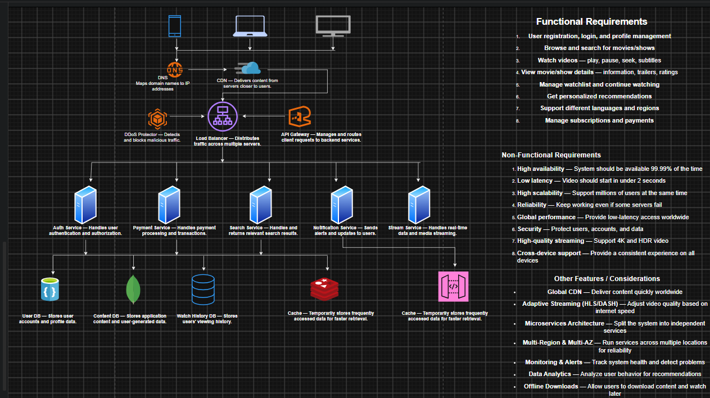

# Experiment 2 — System Design of Netflix

**Name:** Ishaan Sharma  
**UID:** 25BCS80006  
**Subject:** System Design

---

## 1. Objective

To design a scalable, highly available, and reliable video streaming platform similar to Netflix, covering functional and non-functional requirements, capacity estimation, API design, high-level architecture, and database design.

---

# Netflix — system design


## 2. Functional Requirements

| #   | Feature                                            |
| --- | -------------------------------------------------- |
| 1   | User registration, login, and profile management   |
| 2   | Browse and search for movies/shows                 |
| 3   | Watch videos with play, pause, seek, and subtitles |
| 4   | View movie/show details, trailers, and ratings     |
| 5   | Manage watchlist and continue watching             |
| 6   | Get personalized recommendations                   |
| 7   | Support different languages and regions            |
| 8   | Manage subscriptions and payments                  |

---

## 3. Non-Functional Requirements

| Requirement                | Target                                                   |
| -------------------------- | -------------------------------------------------------- |
| **Availability**           | 99.99% uptime                                            |
| **Low Latency**            | Video should start in under 2 seconds                    |
| **High Scalability**       | Support millions of users simultaneously                 |
| **Reliability**            | System should continue working even if some servers fail |
| **Global Performance**     | Provide low-latency access worldwide                     |
| **Security**               | Protect users, accounts, and payment information         |
| **High-Quality Streaming** | Support 4K and HDR video                                 |
| **Cross-Device Support**   | Provide a consistent experience across devices           |

---

## 4. Capacity Estimation

### 4.1 User Base Assumptions

| Metric                   | Value  |
| ------------------------ | ------ |
| Total registered users   | 50 M   |
| Daily Active Users (DAU) | 15 M   |
| Peak concurrent viewers  | 3 M    |
| Average watch session    | 1 hour |

> A moderate-scale platform is assumed for this learning exercise rather than the actual Netflix scale.

### 4.2 API Request Load

Assume each active user makes approximately **6 API requests/minute** for activities such as browsing, searching, updating watch history, and managing profiles.

**Peak API load:**

```text
3M × 6 / 60
≈ 300K requests/sec
```
